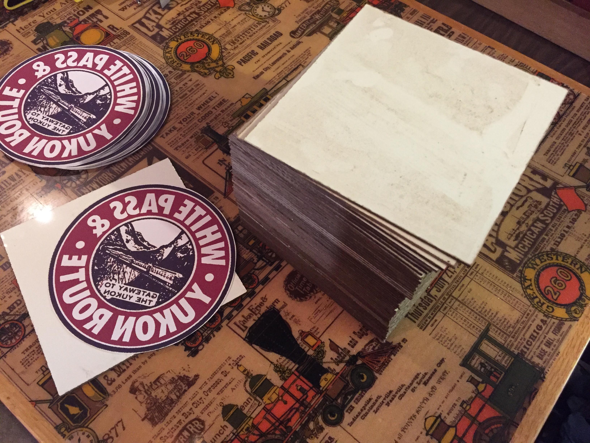
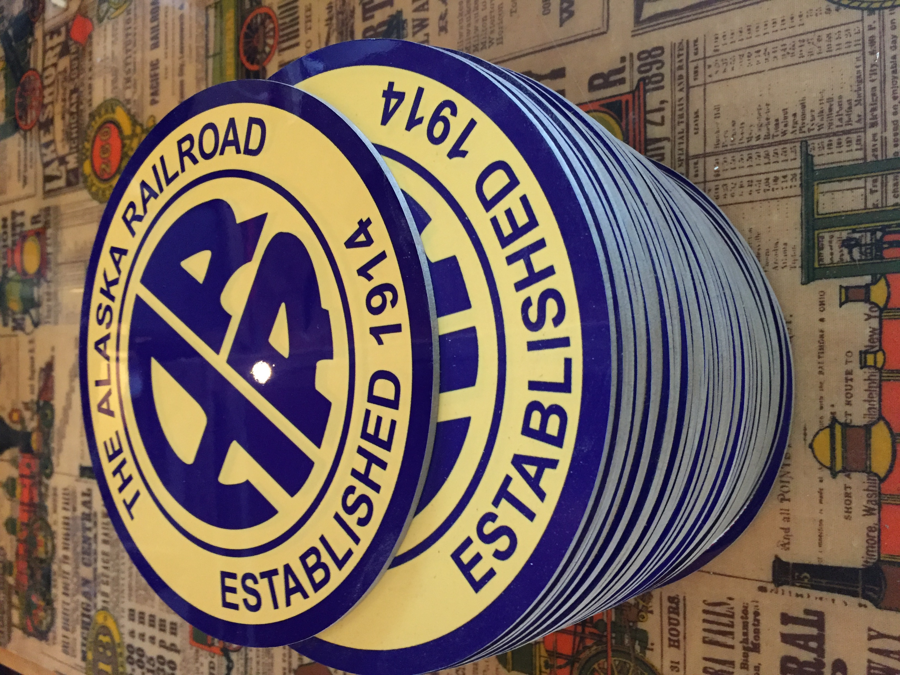

[center]
All railroads had a logo proclaiming their identity, but many are now long gone. Only rail-fans, modelers and historians remember them passing this way through history.
 
Signal Signs has made a 40 plus year effort to capture the accurate heralds that some of us still remember on the side of a passing boxcar or passenger train. We have collected artwork from original sources to have a faithful reproduction of all the products we offer.
 
We have over 400 Railroad and Military heralds, as well as novelty signs and designs. We make metal license plates, mouse-pads, and 3 different sizes of wall plaques with metal available on select models.
 
We have expanded our product line using the newest sublimation technology available. This gives us the ability to offer products you will be proud to display in your home, office, or train room.
 
Custom signs available in wood, metal or Sintra®

Contact below for details.
[/center]

  

 
* Signal Signs was started in 1969. We used silk screen printing including several screens for each color until the early 2000's. We eventually discovered the main process we have in place today which is Sublimation printing. Basically we use a 400 degree heat press to melt a reverse image onto a board with a special surface that accepts the image. We print signs on wood, metal and mouse pads as well as other products that I have not explored yet.
* Above is a table shot of us doing a run of our 4" size signs. Some would call them coasters but really they are great for decorating a train themed room, the edge of a mini-bar or whatever you can imagine as a use or design.
* We have a customization shop as well so if there are party favors you need, gifts for a family reunion, Bridal/baby shower trinkets etc. Feel free to call and we will find a package that works well for you. Some gift ideas not on the website yet are a picture or design on key-chain, Military style dog tag or a custom shape/size in either metal or 1/8" wood Masonite.
 
 
If you have any questions about our services, or would like to make an inquiry about a custom sign, herald, or logo order, please contact us below.